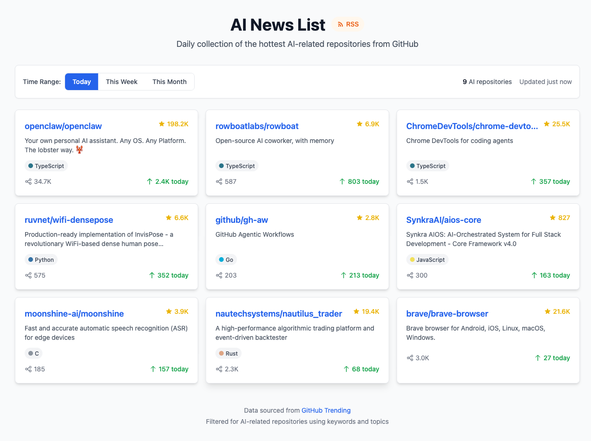

# AI News List

<div align="center">



**每日收集 GitHub 上最热门的 AI 相关仓库**

[](https://nextjs.org/)
[](https://www.typescriptlang.org/)
[](https://tailwindcss.com/)
[](LICENSE)

[在线演示](#) | [功能特性](#功能特性) | [快速开始](#快速开始) | [部署](#部署)

</div>

---

## 📖 简介

AI News List 是一个自动追踪 GitHub Trending 的 Web 应用，专门收集和展示与人工智能相关的热门开源项目。通过智能关键词过滤，帮助你发现最新、最火的 AI 开源项目。

## ✨ 功能特性

### 🔥 核心功能

- **GitHub Trending 抓取** - 实时获取 GitHub 热门仓库数据
- **AI 智能过滤** - 通过 60+ 关键词、30+ Topics 智能识别 AI 相关项目
- **多时间范围** - 支持每日、每周、每月三种时间维度
- **RSS 订阅** - 支持 RSS 阅读器订阅，随时获取更新

### 🎨 界面特性

- **响应式设计** - 完美适配桌面端和移动端
- **暗色模式** - 自动跟随系统主题
- **加载骨架** - 优雅的加载状态展示
- **实时统计** - 显示仓库数量和更新时间

### 🛠️ 技术特性

- **服务端缓存** - 智能缓存减少 API 调用
- **Docker 支持** - 一键容器化部署
- **TypeScript** - 完整的类型安全
- **零配置部署** - 支持 Vercel 一键部署

## 📊 过滤规则

项目使用以下规则识别 AI 相关仓库：

### 关键词匹配
```
machine learning, deep learning, neural network, LLM, GPT,
transformer, pytorch, tensorflow, langchain, openai, huggingface,
stable diffusion, chatbot, RAG, embedding, fine-tuning...
```

### Topics 匹配
```
machine-learning, deep-learning, artificial-intelligence,
neural-network, nlp, computer-vision, llm, gpt, transformer,
pytorch, tensorflow, langchain, generative-ai...
```

### 编程语言
```
Python, Jupyter Notebook, R, Julia
```

## 🚀 快速开始

### 环境要求

- Node.js 18+
- npm 或 yarn

### 本地开发

```bash
# 克隆仓库
git clone https://github.com/BeCuriousCat/ai-news-list.git
cd ai-news-list

# 安装依赖
npm install

# 启动开发服务器
npm run dev
```

打开 http://localhost:3000 查看效果。

### 生产构建

```bash
# 构建
npm run build

# 启动生产服务器
npm run start
```

## 🐳 Docker 部署

### 使用 Docker Compose（推荐）

```bash
# 构建并启动
docker-compose up -d --build

# 查看日志
docker-compose logs -f

# 停止
docker-compose down
```

### 使用 Docker

```bash
# 构建镜像
docker build -t ai-news-list .

# 运行容器
docker run -d -p 3000:3000 --name ai-news-list ai-news-list
```

## 📡 RSS 订阅

支持以下 RSS 订阅地址：

| 时间范围 | 订阅地址 |
|---------|---------|
| 每日 | `/api/rss?since=daily` |
| 每周 | `/api/rss?since=weekly` |
| 每月 | `/api/rss?since=monthly` |

在 RSS 阅读器（如 Feedly、Inoreader）中添加完整地址即可订阅。

## 🔧 配置

### 环境变量（可选）

| 变量名 | 说明 | 默认值 |
|-------|------|-------|
| `GITHUB_TOKEN` | GitHub Token，提高 API 限额 | - |

### 获取 GitHub Token

1. 访问 [GitHub Token 设置](https://github.com/settings/tokens/new)
2. 创建 Token（无需任何权限）
3. 配置环境变量

```bash
# Docker Compose
environment:
  - GITHUB_TOKEN=ghp_xxxxx

# 或直接运行
GITHUB_TOKEN=ghp_xxxxx npm run start
```

## 📁 项目结构

```
ai-news-list/
├── src/
│   ├── app/                    # Next.js App Router
│   │   ├── api/
│   │   │   ├── trending/       # Trending API
│   │   │   └── rss/            # RSS API
│   │   ├── page.tsx            # 主页面
│   │   ├── layout.tsx          # 布局
│   │   └── globals.css         # 全局样式
│   ├── components/             # React 组件
│   │   ├── RepositoryCard.tsx  # 仓库卡片
│   │   ├── RepositoryList.tsx  # 仓库列表
│   │   └── FilterBar.tsx       # 过滤栏
│   └── lib/                    # 核心逻辑
│       ├── scraper.ts          # 页面抓取
│       ├── filter.ts           # AI 过滤
│       ├── cache.ts            # 缓存管理
│       ├── rss.ts              # RSS 生成
│       └── types.ts            # 类型定义
├── public/                     # 静态资源
├── Dockerfile                  # Docker 配置
├── docker-compose.yml          # Docker Compose 配置
└── package.json
```

## 🤝 贡献

欢迎提交 Issue 和 Pull Request！

## 📄 许可证

[ISC License](LICENSE)

---

<div align="center">

Made with ❤️ by [BeCuriousCat](https://github.com/BeCuriousCat)

</div>
